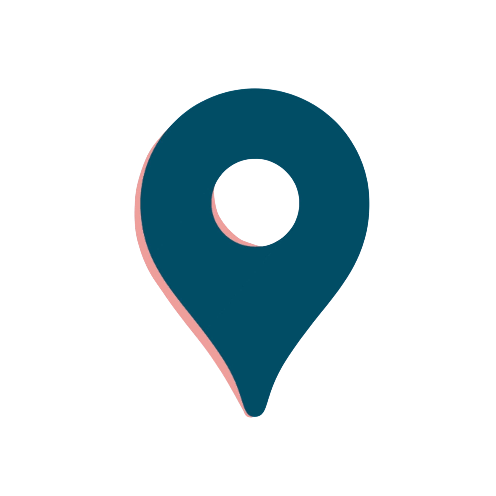
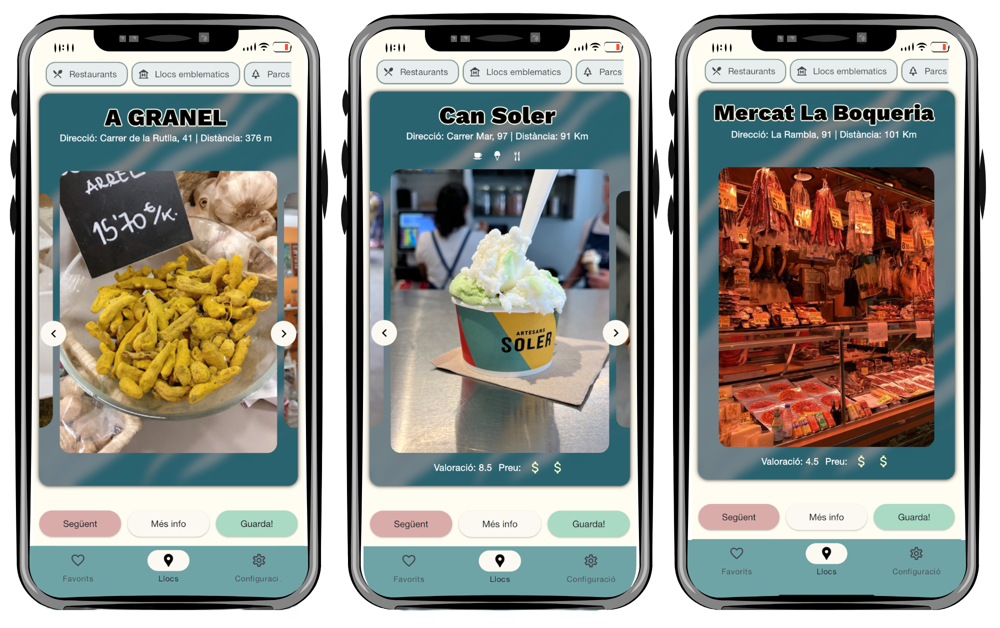
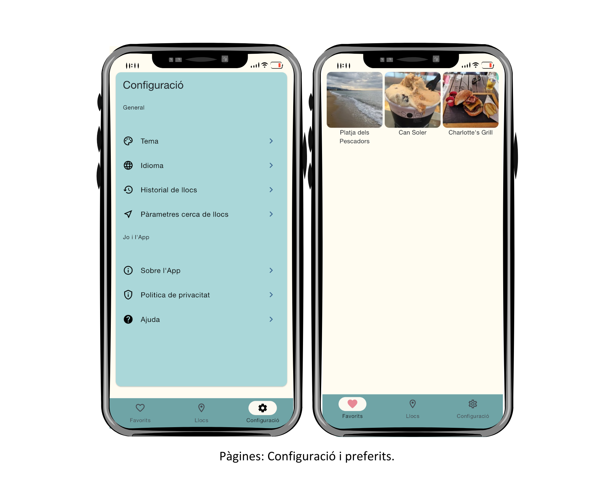
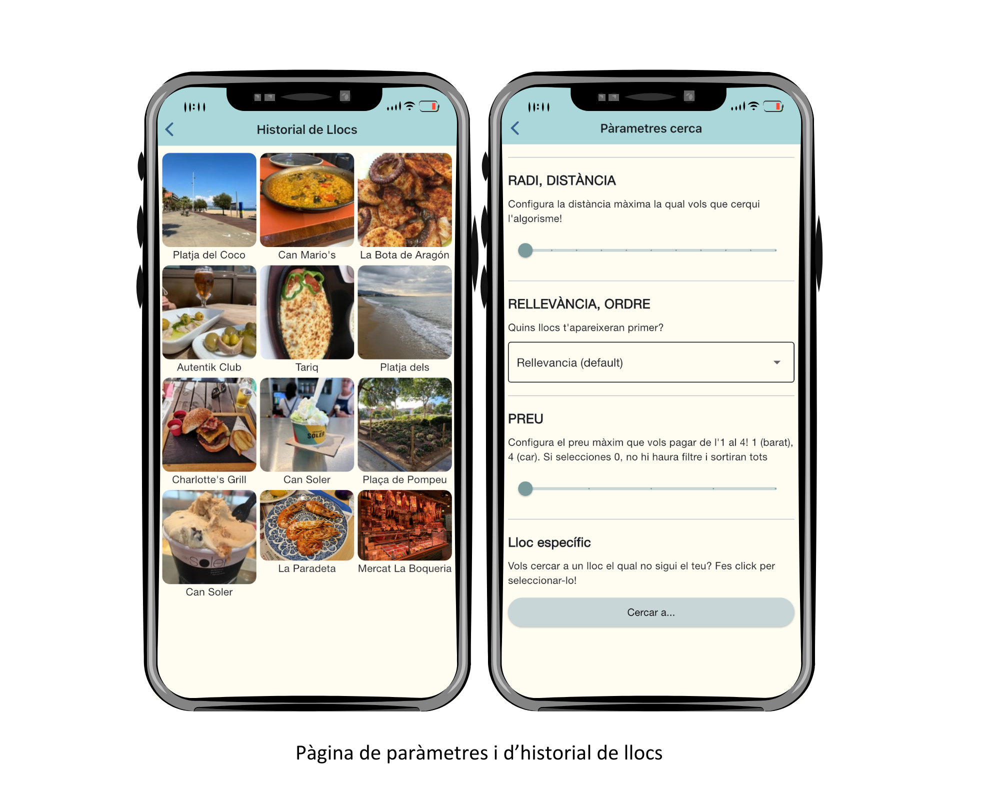
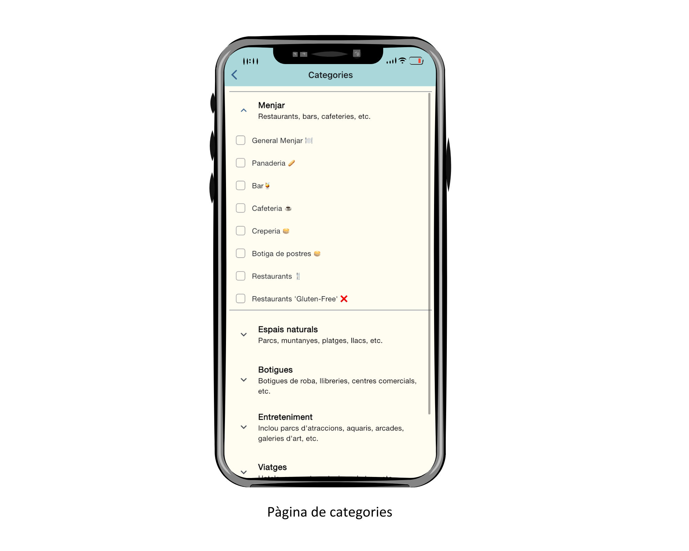
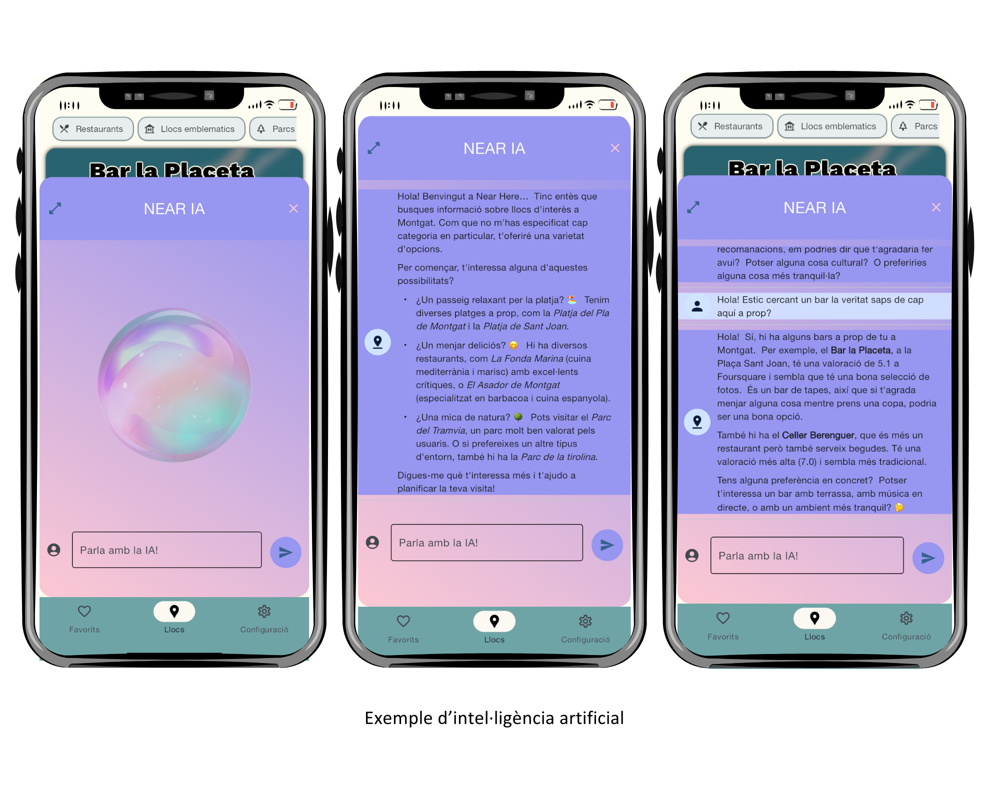
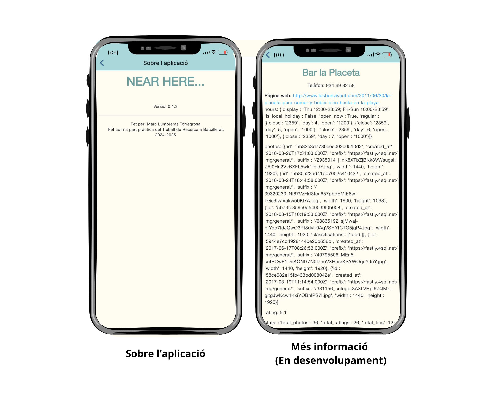
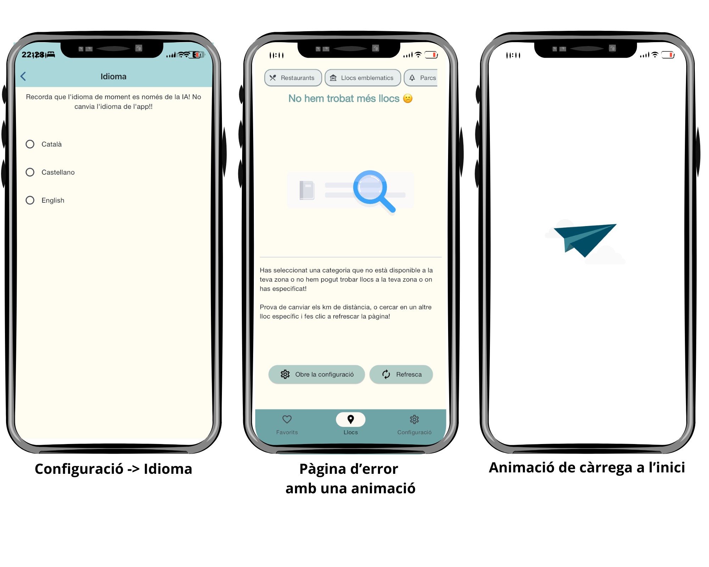

<h1 style="display: flex; align-items: center; gap: 16px; font-size: 2.5em;">
    
    Near Here...
</h1>

*Logo made by [lexgod91](https://www.instagram.com/lexarts91?igsh=aHpxa3Y5a3R2cXRs)*  
**Discover sustainable places near you with AI**

[](https://www.python.org/downloads/)
[](https://flet.dev/)
[](LICENSE)
[]()

<p align="center" style="margin-top: -24px;">
    
</p>

## 🎯 About

**Near Here** is a mobile app built with Python and Flet that helps you discover nearby sustainable places using AI. I know it's not the best or most polished project, but it's a first step into programming as part of my High School Research Project 2024-2025. 

Gràcies a aquest codi he après molt com funciona el sistema de versions de GitHub (i també m'he estressat molt), també he après com amb unes nocions de Python i una documentació pots tirar endavant un projecte individual o inclús he comprovat que no és mentida que els programadors ens parem a pensar cada dia en solucions quan alguna cosa no funciona. Molt agraït del que m'ha portat aquest codi i projecte, encara que sembli un codi bàsic i poc optimitzat el procés per arribar-ne fins aquí ha sigut llarg i constant. Tanmateix, com el primer plantejament d'un projecte amb més magnitud que "una simple calculadora" o "una pokedex". 

Also I have to say I don't have Foursquare or Yelp premium, so I don't know if it work as well as it worked when there were more free options in the API. I hope it works!

P.S.: I have to say I'm working on updating the project to support the latest version of Flet. (Lottie is broken, New UI ~~sucks~~ _could be improved_ cause it changed the properties, etc, etc.)

## ✨ Features

<div align="center">
  
  
  
</div>

<div align="center">
  
  
  
</div>

- 🗺️ **Real-time geolocation** with Foursquare & Yelp APIs
- 🤖 **AI Assistant** powered by Google Gemini (multi-language)
- 🌱 **Sustainability focus** - prioritizes eco-friendly places
- ⭐ **Favorites & History** tracking
- 🔍 **Advanced filters**: distance, price, categories, ratings
- 🎨 **Tinder-like UI** with swipe gestures

## 🚀 Quick Start

```bash
# Clone & install
git clone https://github.com/mtorregrosadev/Near-Here.git
cd Near-Here
pip install -r requirements.txt

# Configure API keys
cp .env.example .env
# Edit .env with your keys

# Run
python main.py
```
